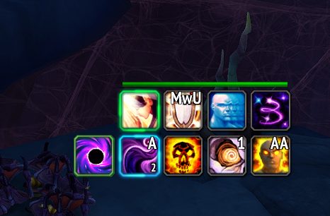

# Burst CD Indicator — Feature Documentation

## Summary

Adds a small icon next to the main spell (position 1) that shows when a major offensive cooldown (2+ minute CD) is ready to use. This addresses the fact that Blizzard's Combat Assistant intentionally deprioritises burst cooldowns in the rotation queue, leaving players without a clear visual cue for when to pop their big CDs.

## Problem

Blizzard's `C_AssistedCombat` API exposes burst cooldowns like **Void Eruption** in `GetRotationSpells()`, but deliberately keeps them at the bottom of the priority list. They never appear in position 1 (`GetNextCastSpell`). This is by design — Blizzard states the Combat Assistant is *"non-optimal by design"* to avoid giving addon-assisted players an unfair advantage on burst timing.

Additionally, in WoW 12.0 (Midnight), `C_Spell.GetSpellCooldown()` returns **secret values** in combat, making it impossible to read exact cooldown durations through the normal API.

## Solution

A local cooldown tracking system that:

1. **Listens to `UNIT_SPELLCAST_SUCCEEDED`** to detect when the player casts a burst CD
2. **Uses `GetSpellBaseCooldown()`** (which is NOT secret in 12.0) to estimate the cooldown duration
3. **Displays a visual indicator** next to position 1 showing the burst CD state

### Visual States

| State | Appearance |
|-------|-----------|
| **CD Ready** | Full-colour icon with pulsing green glow |
| **On Cooldown** | Desaturated icon with cooldown swipe overlay |
| **Out of Combat** | Hidden (only shown in combat) |

## Screenshot

## Current Scope (Demo)

This initial implementation covers **Shadow Priest** only:

| Class | Spell | Spell ID |
|-------|-------|----------|
| Shadow Priest | Void Eruption | 228260 |

Other classes can be added later by extending `SpellDB.CLASS_BURST_DEFAULTS`.

## Files Modified

| File | Change |
|------|--------|
| `SpellDB.lua` | Added `CLASS_BURST_DEFAULTS` table and `ResolveBurstCooldownSpells()` |
| `BlizzardAPI.lua` | Added burst cooldown tracking system (register, record, query) |
| `UIFrameFactory.lua` | Added `CreateBurstCDIndicator()` — creates the icon frame |
| `UIRenderer.lua` | Added burst indicator update logic in `RenderSpellQueue()` |
| `Options.lua` | Added "Show Burst CD Indicator" toggle |

## Configuration

- `/jac` → **Show Burst CD Indicator** toggle (enabled by default)
- Position: left of icon 1 (follows queue orientation)
- Size: matches position 1 icon size

## Technical Notes

- Uses the same local cooldown tracking pattern as the existing defensive spell system
- `GetSpellBaseCooldown()` is confirmed NOT secret in 12.0 combat
- The indicator is only created if the player's class has entries in `CLASS_BURST_DEFAULTS`
- Spec changes / talent updates clear the tracking cache automatically
